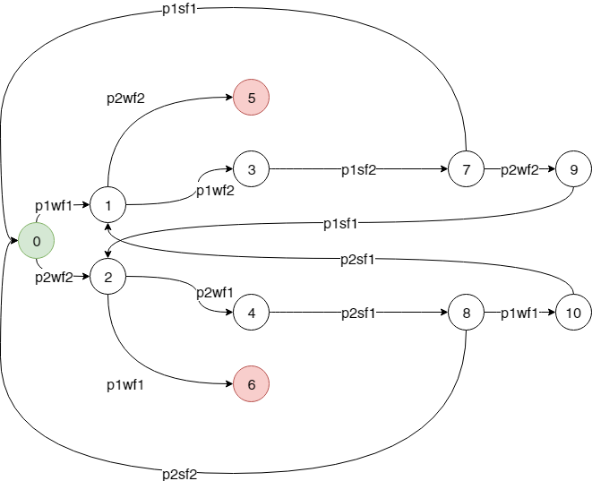
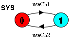

# Exercise 10

## Assignments

### Safety/Deadlock Assignment

#### Code

```JS
/*
resourceA = new Semaphore(1)
*/
A = (t1wa -> t1sa -> A
   | t2wa -> t2sa -> A).
/*
resourceB = new Semaphore(1)
*/
B = (t1wb -> t1sb -> B
   | t2wb -> t2sb -> B).

// Thread 1
/*
while (true) {
    resourceA.wait()
        resourceB.wait()
            # critical section
        resourceB.signal()
    resourceA.signal()
}
*/
T1 = (t1wa -> t1wb -> t1sb -> t1sa -> T1).

// Thread 2
/*
while (true) {
    resourceB.wait()
        resourceA.wait()
            # critical section
        resourceA.signal()
    resourceB.signal()
}
*/
T2 = (t2wb -> t2wa -> t2sa -> t2sb -> T2).

// System
||SYS = (T1 || T2 || A || B).
```

#### Does LTSA detect it?

Yes, it does. It gives:

```
Trace to DEADLOCK:
    t1wa
    t2wb
```

#### How can you detect a deadlock from the FSP model itself?

You can't. At least, not statically. You would have to "simulate" the code in your mind, as we would with normal code.

### Dining philosophers

#### Draw the transition diagram (manually) for a system whith two philisophers.



#### Model a system with 3 philosophers and 3 forks in FSP and demonstrate a deadlock.

```JS
// Philosopher 1
/*
while (true) {
    wait(fork1)
    wait(fork2)
    # eat
    signal(fork2)
    signal(fork1)
}
*/
P1 = (p1wf1 -> p1wf2 -> p1sf2 -> p1sf1 -> P1).
P2 = (p2wf2 -> p2wf3 -> p2sf3 -> p2sf2 -> P2).
P3 = (p3wf3 -> p3wf1 -> p3sf1 -> p3sf3 -> P3).

F1 = (p1wf1 -> p1sf1 -> F1
    | p3wf1 -> p3sf1 -> F1).
F2 = (p1wf2 -> p1sf2 -> F2
    | p2wf2 -> p2sf2 -> F2).
F3 = (p2wf3 -> p2sf3 -> F3
    | p3wf3 -> p3sf3 -> F3).

||SYS = (P1 || P2 || P3
      || F1 || F2 || F3).

```

##### Deadlock

```
Trace to DEADLOCK:
    p1wf1
    p2wf2
    p3wf3
```

#### *Optional: Extend the FSM description to handle N philosophers by using indexing, prefixing, relabeling etc.*

```JS
P = (right.get -> left.get ->
     left.put -> right.put -> P).

F = (get -> put -> F).

||SYS(N = 3) =
    forall [i:0..N-1]
        (p[i]:P ||
         {p[i].left, p[((i - 1) + N)%N].right}::F).
```

##### How many philosophers can LTSA handle? Be a little careful, trying a very large number can make the computer rather unresponsive.

With 10 philosophers everything completed in under 1 s.

With 11 philosophers in about 4 s.

With 12 philosophers in about 32 s.

With 15, it didn't complete at all. I stopped execution after about 5 minutes at

* depth 17591739;
* #states 3790000;
* #transitions 37689260;
* memory used 2770369 KB.

My computer was then alternating between 30 % - 100 % CPU usage, and at 84 % physical memory use (of 16 GB).

#### *Optional: We want to get rid of the deadlock. Make one of the philosophers left-handed (picking up the forks in the other order).*

```JS
P(I = 0) = (when (I != 0)
                right.get -> left.get ->
                left.put -> right.put -> P
          | when (I == 0)
                left.get -> right.get ->
                right.put -> left.put -> P).

F = (get -> put -> F).

||SYS(N = 3) =
    forall [i:0..N-1]
        (p[i]:P(i) ||
         {p[i].left, p[((i - 1) + N)%N].right}::F).
```

##### Does that solve the problem?

Yes, it does. As long as at least one philosopher is right-handed and one is left-handed, we cannot get a deadlock.

#### *Optional: The left-handed philosopher has consequences for fairness. Why?*

Because the other right-handed philsosophers may still have to wait for other right-handed philosophers in an "almost" circle.

##### Can you come up with (or Google..) fair solutions that does not have a deadlock?

###### Mine

* If every other philosopher is either right-handed or left-handed, the solution guarantees that we have at least one right-handed and one left-handed philosopher at the table. This solves the deadlock. As they are sitting one after the other, with alternating hand preference, this will be more fair to all the right-handed philosophers. But it will be random, and it would still be possible for starvation to occur; i.e. not entirely fair.

###### Google's

* A philosopher who wants to eat first picks up the sole salt shaker on the table, then picks up his chopsticks, eats and then puts the salt shaker back. This solution while viable isn't great, as it means that only one philosopher can eat at any one time. This solution breaks the 'holding while acquiring' deadlock condition and if we further stipulate that the philosophers agree to go around the table and pick up the salt shaker in turn, this solution is also fair and ensures no philosopher starves.
* Each philosopher flips a coin. Heads, he picks up the right chopstick first, tails, the left. If the second chopstick is busy, he puts down the first and tries again. With probability 1, he will eventually eat. Again, this solution relies on defeating circular waiting whenever possible and then resorts to breaking 'acquiring while holding' as assurance for the case when two adjacent philosophers' coins both come up the same. Again, this solution is fair and ensures all philosophers can eat eventually.
* The chef sees the philosopher's predicament, scorns the philosophers for letting his fine meal of noodles go cold and agrees with the philosophers that he'll dictate who should eat and when to prevent any confusion. This breaks the 'blocking shared resources' condition. The chef assures all philosophers that when they try to pick up their chopsticks, they will be free. Effectively the chef enforces a fair, serialized schedule of chopstick use over the philosophers. This is the most efficient solution (no shared resources/locking involved) but is in practice the hardest to achieve (the chef must know how to instruct the philosophers to eat in a fair, interference-free fashion). [Aside: For the curious, if we number the philosophers 1 to 5, one such schedule would be (3, 5)->(1, 4)->(2, 4)->(1, 3)->(5, 2) or any permutation thereof. This always ensures each philosopher can pick up both chopsticks in turn, is fair - each philosopher gets to eat twice during the schedule - and will neither deadlock nor starve.]

## Communication

### How would you model the sending of data over a synchroneous channel in FSP?

```JS
// Thread 1
/*
while (true) {
    send(ch1, data)
    recv(ch2, data)
}
*/
T1 = (useCh1 -> useCh2 -> T1).

// Thread 2
/*
while (true) {
    recv(ch1, data)
    send(ch2, data)
}
*/
T2 = (useCh1 -> useCh2 -> T2).

||SYS = (T1 || T2).
```

#### How many states will there be in the transition diagram of this system?

There will be 2.



### Assume the channels are buffered (asynchroneous communication). How would now a channel need to be modeled in FSP?

My attempt below. It doesn't quite work, but I think I'm onto something. It presents way too many states for it to be working properly. With N = 5 it gives 144 states.

```JS
const N = 5

// Thread 1
/*
while (true) {
    put(ch1, data)
    get(ch2, data)
}
*/
T1 = (put -> get -> T1).

// Thread 2
/*
while (true) {
    get(ch1, data)
    put(ch2, data)
}
*/
T2 = (get -> put -> T2).

CHANNEL = CHANNEL[0],
CHANNEL[i:0..N]
    = (when (i < N) put -> CHANNEL[i + 1]
     | when (i > 0) get -> CHANNEL[i - 1]).

||ASYNC_CHANNEL = (t1::T1
                || t2::T2
                || {t1.c1, t2.c1}::CHANNEL
                || {t1.c2, t2.c2}::CHANNEL).
```
